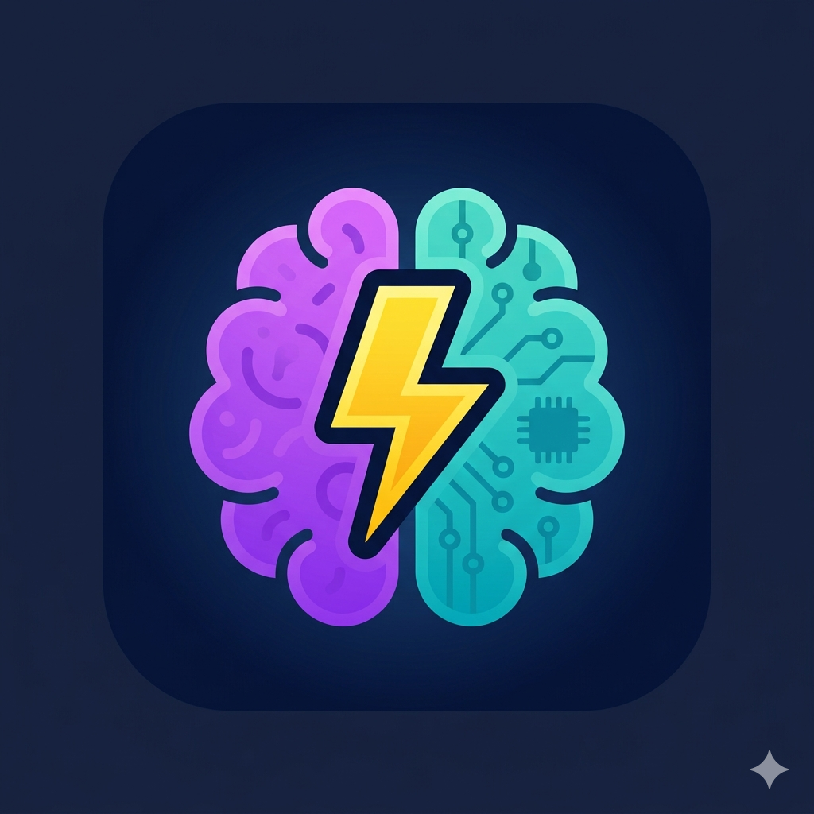

# 🏝️ Nexoria

**Nexoria** ist eine interaktive, webbasierte Lern-Plattform für Kinder und Jugendliche im Alter von 8 bis 14 Jahren. Spielerisch entdecken die Nutzer verschiedene "Wissens-Inseln", sammeln XP und verdienen sich Fach-Abzeichen in Kategorien wie Natur, Technik, Geschichte und Sprachen.



## 🌟 Features

* **Interaktive Wissens-Inseln:** Verschiedene Kategorien (Biologie, Kosmos, Geschichte, Logik, Sport, Englisch).
* **Altersgerechte Level:** Zwei Schwierigkeitsstufen (Junior 8-10 J. und Profi 11-14 J.).
* **Motivierendes Badge-System:** Fachliche Errungenschaften und Meilensteine (z.B. "Astronaut" oder "Insel-König").
* **Vielfältige Aufgabentypen:** Klassische Quiz-Fragen, Muster-Rätsel, Code-Eingaben und Hybrid-Aufgaben.
* **PWA-Ready:** Kann dank Service Worker und Web Manifest als App auf dem Smartphone installiert werden.
* **Datenschutzfreundlich:** Alle Spielstände werden lokal im Browser (`localStorage`) gespeichert – keine Cloud, kein Login-Zwang.
* **Kindersicher:** Bewusster Verzicht auf "Nacht-Boni" zur Förderung einer gesunden Schlafhygiene.

## 🚀 Installation & Start

Da Nexoria eine reine Client-Side Web-App ist, benötigst du keinen Server-Backend.

1.  **Repository klonen:**
    ```bash
    git clone [https://github.com/DEIN-NUTZERNAME/nexoria.git](https://github.com/DEIN-NUTZERNAME/nexoria.git)
    ```
2.  **Dateien öffnen:**
    Öffne einfach die `index.html` in einem modernen Webbrowser.

3.  **Hosten (Optional):**
    Du kannst das Projekt einfach über **GitHub Pages** oder Vercel/Netlify hosten, um es online zugänglich zu machen.

## 🛠️ Technische Details

* **Frontend:** HTML5, CSS3 (Flexbox/Grid), Vanilla JavaScript.
* **Datenstruktur:** Aufgaben sind in modularen `.json` Dateien organisiert (`category-1.json` etc.).
* **Offline-Support:** Service Worker (`sw.js`) für die Nutzung ohne Internetverbindung.
* **Design:** Responsives "Mobile First" Design mit CSS-Variablen und Glasmorphismus-Effekten.

## 📂 Struktur

```text
.
├── index.html          # Hauptanwendung & Logik
├── manifest.json       # PWA Konfiguration
├── sw.js               # Service Worker für Offline-Caching
├── icon.png            # App-Icon
├── category-1.json     # Bio-Dschungel Fragen
├── category-3.json     # Zeitreise Fragen
├── category-4.json     # Kosmos & Technik Fragen
├── category-5.json     # Rätsel-Reich Fragen
├── category-6.json     # Sport & Spiel Fragen
└── category-7.json     # English Explorer Fragen
